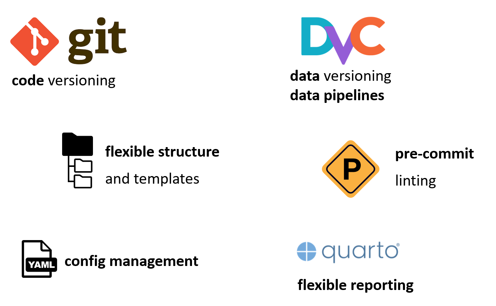

# DSO: data science operations

_DSO_ is a command line helper for building reproducible data anlaysis projects with ease by connecting our favorite tools:
It builds on top of git and [dvc](https://github.com/iterative/dvc) for code and data versioning and provides project
templates, linting checks, hierarchical overlay of configuration files and integrates with quarto and jupyter notebooks.

At Boehringer Ingelheim, we introduced DSO to meet the high quality standards required for biomarker analysis
in clinical trials. DSO is under active development and we value community feedback.

<table width="100%">
    <tr>
        <td width="35%"></td>
        <td></td>
    </tr>
</table>

## Getting started

Please refer to the documentation, in particular ...

## Installation

TODO

## Release notes

See the [changelog](CHANGELOG.md).
