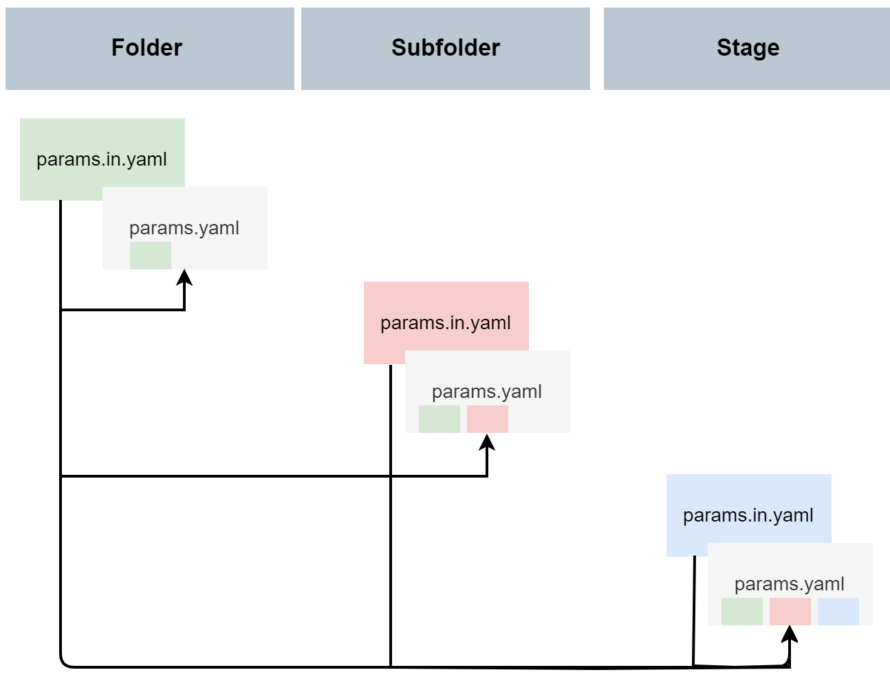

# DSO: data science operations


*DSO* is a command line helper for building reproducible data anlaysis projects with ease.
It builds on top of [dvc](https://github.com/iterative/dvc) for data versioning and provides project
templates, linting checks, hierarchical overlay of configuration files and integrates with quarto and jupyter notebooks.

At Boehringer Ingelheim, we introduced DSO to meet the high quality standards required for biomarker analysis
in clinical trials. DSO is still under early development and we value community feedback.

## Getting started

### What is DVC?
[DVC](https://github.com/iterative/dvc) is like "git for data". It can version large data files and data directories alongside source code tracked with git. In addition to versioning files, dvc can be used to run analyses in a reproducible way by declaring input and output files as well as commands to be executed in a `dvc.yaml` configuration file. After executing an analysis, timestamps and checksums of all input and output files are stored in a `lock` file, providing a provenance record. Different analysis tasks are organized in *stages*. Since input and output files of each stage are declared, dvc can build a dependency graph of the stages to re-execute stages as appropriate if input data or preprocessing steps have been updated.

### Creating a project from a template
There are three types of DSO templates: project, folders and stages. A *project* is the root of your project
and always a git repository at the same time. It can be created using `dso init`. A *stage* is an executable
step of your analysis (usually one script with defined inputs and outputs) organized in a folder. Stages
cannot be nested. A *folder* is used to organize stages in a hierarchical way within the project.

You can use `dso init` to create a new project
```
$> dso init
Please enter the name of the project, e.g. "single_cell_lung_atlas": my_cool_project
Please add a short description of the project: This analysis solves *all* the problems!
```

Within a project, you can use `dso create` to initalize folders and stages from a predefined template

```
$> dso create stage
? Choose a template: (Use arrow keys)
   bash
 » quarto
Please enter the name of the stage, e.g. "01_preprocessing": 02_quality_control
Please add a short description of the stage: Make a PCA to detect outliers
```

### How-to write and use config files
The config files in a project, subfolder or stage are the cornerstone of any reproducable analysis by minimising analysis configuration errors within related scripts. Additionally, config files reduce the time needed to modify your scripts when changing configurations such as p-value cutoffs, excluded samples, output directory, data input, and many more.

A config file of a project, subfolder, or stage contains all necessary parameters that should be consistent across the analyses. Therefore, changing parameters is done within the config files and not individually within an analysis script.

In DSO two parameter files are given called `params.yaml` and `params.in.yaml`. `params.yaml` is an autogenerated YAML containing all the parameters specified in the params.in.yaml and other params.yaml files in its parent directories (see figure below for an example how this behaves in real). `params.yaml` will be compiled when running `dso compile-config`.



```
$> dso compile-config
[08/22/24 20:53:43] INFO     Detected /home/grst/my_cool_project as project root.
                    INFO     Compiling a total of 2 config files.
                    INFO     Configuration compiled successfully.
```

### Linting checks

Dso provides linting checks that detect common errors in analysis projects. Right now only few checks are implemented,
but more will be available in the future.

To run the linting checks manuall, execute

```
$> dso lint
[08/22/24 20:53:43] INFO     Compiled a list of 22 to be linted
```

However, it is preferable to execute linting checks as pre-commit hooks and/or as continuous integration checks.
A `.pre-commit-config.yaml` comes with the DSO project template. Simply activate it using `pre-commit install`.

### Reproducing projects

To reproduce/execute all stages within a project, run

```
$> dso repro
```

This is a thin wrapper around `dvc repro` that compiles all configuration files beforehand.
DVC will only reproduce stages defined in the dvc.yaml where changes have been made. When dependencies have been changed, previous stages will also be re-run.


### Integration with quarto

DSO provides some additional tooling around quarto documents for generating reproducible reports. When you create a
quarto stage via `dso create stage --template quarto` you are all set to use this tooling:

 * Render quarto stages to html via `dso exec quarto .`
 * Inherit quarto configuration through the project from the `params.yaml` files. Quarto configuration can be placed in
   `dso.quarto`, e.g.
   ```yaml
   dso:
     quarto:
        author:
          - Jane Doe
        execute:
          warning: false
    ```
  * Add a disclaimer box and watermarks to all plots (e.g. to mark them as drafts) by adding additional settings
    ```yaml
    dso:
      quarto:
        watermark:
          text: DRAFT
        disclaimer:
          title: This document is a DRAFT
          text: Please do not share!
    ```

To access stage parameters and resolve file paths relative to the stage directory from within R, we provide the
companion package [`dso-r`](https://github.com/Boehringer-Ingelheim/dso-r) that provides the two functions
`read_params(stage_name)` and `stage_here(path)`.


## Installation

DSO requires Python 3.10 or later.

You can install the latest version with pip using

```bash
pip install dso-core
```

Alternatively, you can install the development version from GitHub:

```bash
pip install git+https://github.com/Boehringer-Ingelheim/dso.git@main
```

## Release notes

See the [changelog](./CHANGELOG.md).

## Credits

dso was initially developed by
 * [Gregor Sturm](https://github.com/grst)
 * [Tom Schwarzl](https://github.com/tschwarzl)
 * [Daniel Schreyer](https://github.com/dschreyer)
 * [Alexander Peltzer](https://github.com/apeltzer)

DSO depends on many great open source projects, most notably [dvc](https://github.com/iterative/dvc), [hiyapyco](https://github.com/zerwes/hiyapyco) and [jinja2](https://jinja.palletsprojects.com/).
